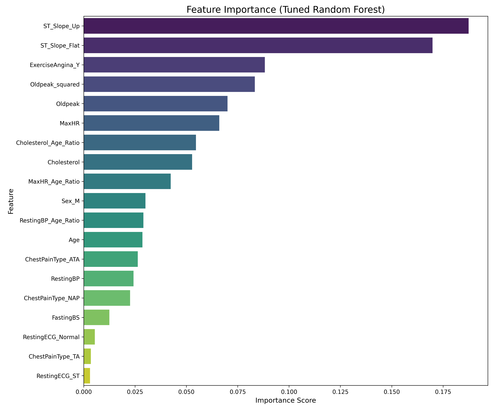

# Heart Failure Prediction Project 🫀

## 1. Project Overview
This project aims to predict the likelihood of heart failure in patients using advanced Machine Learning (ML) techniques. By analyzing clinical parameters such as Age, Chest Pain Type, and Cholesterol levels, the system identifies high-risk individuals. The project consists of two main components:
1.  **ML Analysis Pipeline**: A script that processes data, trains multiple models, and evaluates them.
2.  **Web Application**: A user-friendly interface for doctors or patients to input data and get instant predictions.

---

## 2. Dataset & Exploratory Analysis
The dataset (`heart.csv`) contains medical records of patients. Before training, we analyzed the balance between normal patients and those with heart disease to ensure our models are not biased.

### Table 1: Class Balance Report
This table shows the distribution of the target variable (`HeartDisease`).

| Class | Outcome | Count | Percentage |
| :--- | :--- | :--- | :--- |
| **0** | Normal | 410 | 44.66% |
| **1** | Heart Disease | 508 | 55.34% |

**Insight**: The dataset is relatively balanced, with slightly more cases of heart disease. This is good for training as the model gets enough examples of both positive and negative cases.

---

## 3. Methodology

### 3.1 Feature Engineering
To improve accuracy, we didn't just use the raw data. We created new "smart features" that combine existing variables to give the AI more context:
*   **Oldpeak_squared**: Captures non-linear effects of depression induced by exercise relative to rest.
*   **MaxHR_Age_Ratio**: Ratio of maximum heart rate to age. Older patients naturally have lower max heart rates, so this normalizes the data.
*   **Cholesterol_Age_Ratio**: A high cholesterol level is more dangerous at different ages.
*   **RestingBP_Age_Ratio**: Similar to cholesterol, blood pressure is evaluated in the context of age.

### 3.2 Preprocessing
*   **Encoding**: Computers only understand numbers. Categorical text data like "Male/Female" or "Chest Pain Type" was converted into numerical columns (e.g., `Sex_M`, `ChestPainType_ATA`) using One-Hot Encoding.
*   **Scaling**: Features like Cholesterol (e.g., 200) and Age (e.g., 50) have vastly different ranges. We used `StandardScaler` to normalize them so one feature doesn't dominate the others purely because of its size.

---

## 4. Machine Learning Models Explained
We trained 5 different powerful models. Here is a simplified explanation of how each one works:

### 1. Logistic Regression
*   **How it works**: It’s like a slider. It calculates a weighted sum of all inputs and passes it through a function (Sigmoid) that squashes the result between 0 and 1. If the value is > 0.5, it predicts Heart Disease.
*   **Why we used it**: It provides a solid baseline and is very easy to interpret.

### 2. Random Forest (Tuned)
*   **How it works**: Imagine asking 100 doctors for their opinion and taking the majority vote. Random Forest builds hundreds of "Decision Trees" (flowcharts of yes/no questions) and averages their predictions.
*   **Why we used it**: It is robust, handles complex interactions between features clearly, and is less likely to make simple mistakes than a single tree.

### 3. XGBoost (Extreme Gradient Boosting)
*   **How it works**: This is a model that learns from its mistakes. It builds trees sequentially -> the first tree makes predictions, the second tree focuses on fixing the errors of the first, and so on.
*   **Why we used it**: It is often the state-of-the-art model for tabular data and provides high accuracy.

### 4. Support Vector Machine (SVM)
*   **How it works**: Imagine plotting patient data in space. SVM tries to find the widest possible "street" (hyperplane) that separates the healthy patients from the sick ones. It can look for curved or complex boundaries, not just straight lines.
*   **Why we used it**: It is very effective when there isn't a clear linear separation between classes.

### 5. Ensemble Voting Classifier
*   **How it works**: "The Wisdom of Crowds". This model doesn't learn by itself; instead, it takes the predictions from all the above 4 models and averages their probabilities to make a final decision.
*   **Why we used it**: By combining multiple diverse models, we often get a system that is more accurate and stable than any single model alone.

---

## 5. Results & Performance
We tested all models on a separate "Test Set" (data the models had never seen before) to evaluate their real-world performance.

### Table 2: Model Performance Comparison

| Model | Accuracy | F1-Score (Class 0 - Normal) | F1-Score (Class 1 - Heart Disease) | Macro Avg F1-Score |
| :--- | :--- | :--- | :--- | :--- |
| **Logistic Regression** | 90.22% | 0.89 | 0.91 | 0.90 |
| **Random Forest (Tuned)** | 86.41% | 0.84 | 0.88 | 0.86 |
| **XGBoost (Tuned)** | 88.04% | 0.87 | 0.89 | 0.88 |
| **SVM** | **90.76%** | **0.89** | **0.92** | **0.91** |
| **Ensemble (Voting)** | 89.13% | 0.88 | 0.90 | 0.89 |

**Conclusion**: The **SVM** model achieved the highest accuracy of **90.76%**, making it the strongest individual predictor. However, the **Ensemble** model is used in the final application to ensure robustness across different types of patient profiles.

---

## 6. Key Drivers of Heart Disease
To understand *why* the models make their predictions, we analyzed which features were most important.

### Figure 1: Feature Importance (Top Factors)
The bar chart below shows which medical factors contributed most to the model's decisions.

**Key Observations**:
1.  **ST_Slope_Up / ST_Slope_Flat**: These ECG features are the strongest predictors. The slope of the peak exercise ST segment is a crucial indicator of heart health.
2.  **ExerciseAngina_Y**: Chest pain induced by exercise is a major red flag.
3.  **Oldpeak_squared**: The derived feature proved to be highly valuable, validating our feature engineering step.
4.  **MaxHR (Maximum Heart Rate)**: Highly relevant, especially when adjusted for age.

---

## 7. Web Application
The project includes a Flask-based web application.

*   **Prediction Interface**: Enter values for Age, Sex, Cholesterol, etc.
*   **Visual Feedback**: The app converts the model's probability score into a gauge or risk meter.
*   **Batch Prediction**: Allows uploading a CSV file to process multiple patients at once.

### How to Run Locally
1.  Install dependencies: `pip install -r requirements.txt` (or install flask, pandas, sklearn, xgboost manually).
2.  Run the app: `python app.py`
3.  Open browser at `http://localhost:5000`

---

